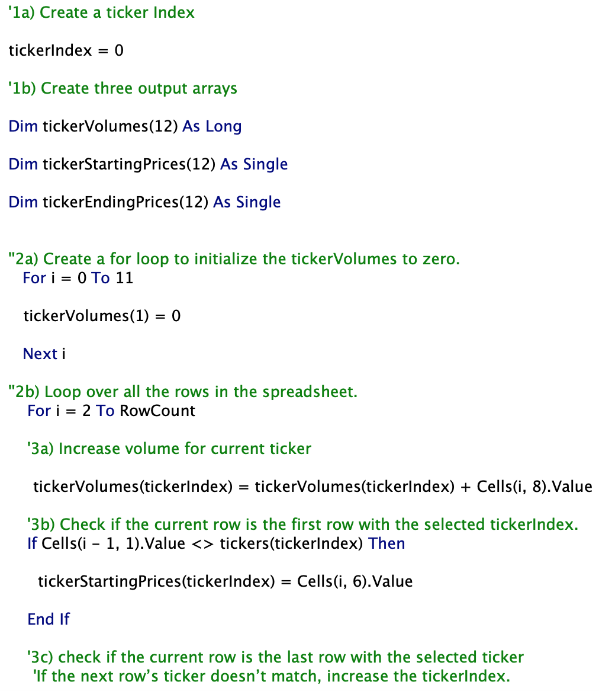
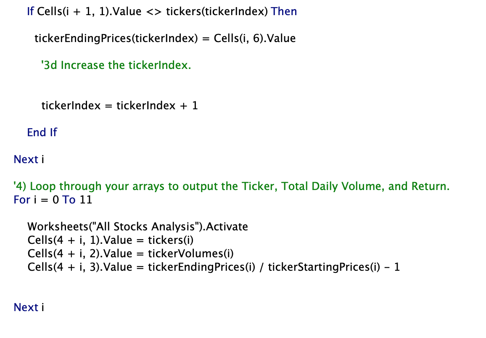
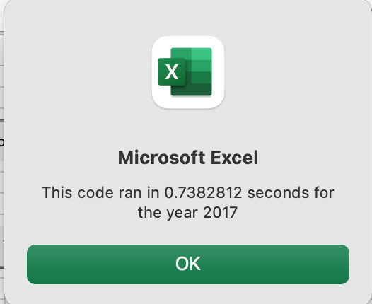
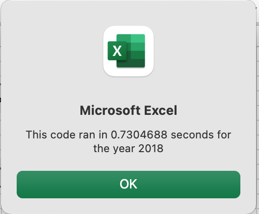
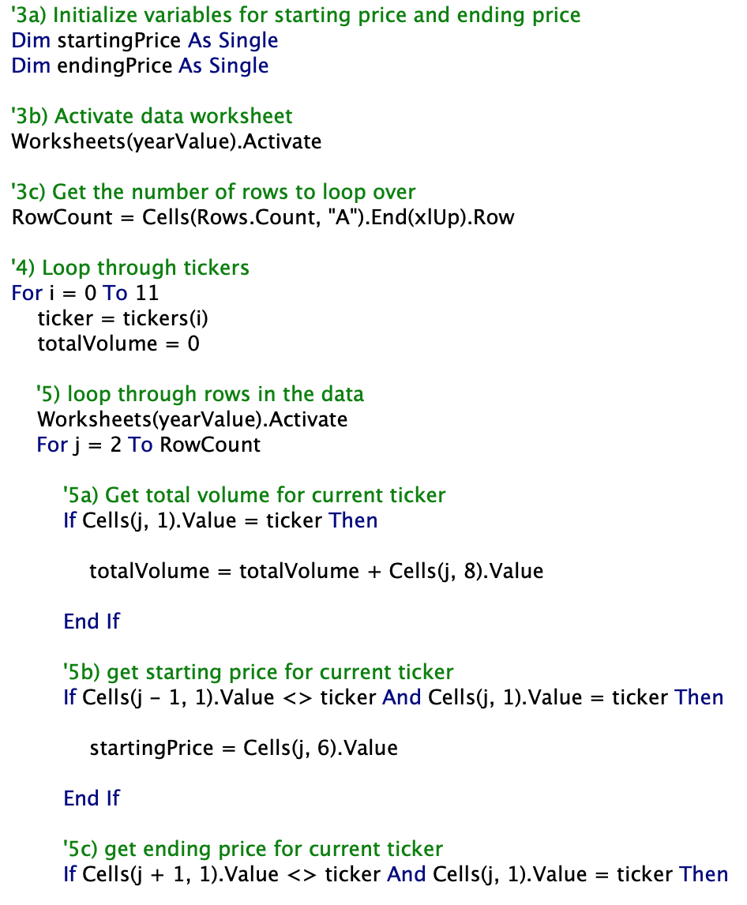
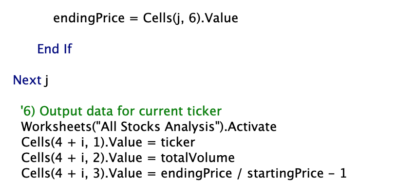
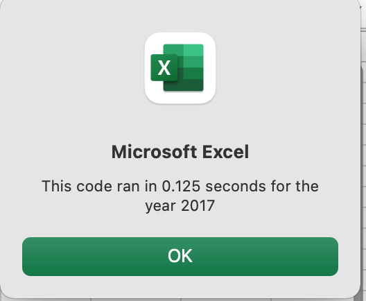
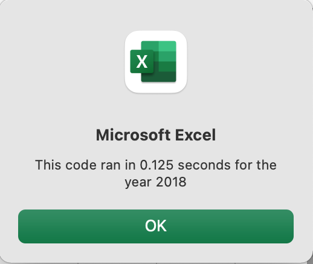

# **Stock-Analysis**

## **Overview of Project**

### **Purpose**
The purpose of this assignment was to help fictional financial advisor, Steve, create a macro on VBA that would analyze all stocks. His parents are particularly interested in investing in DQ stock, but Steve believes the analysis should be run over all stocks. The goal was to refactor the original code to collect all the necessary information through one loop over all the data and do this in less time. The following excel sheet doc was used for the analysis: 

### **Results**
Both scripts initially had similar code where the analysis sheet was formatted to have a header and the initial volume was set to 0 and an array was created for tickers. In the original script the following code was used to capture data on running the analysis for 2017 and 2018. 

It differed from the refactored code by:
  1. Initialized variables for starting price and ending price
  2. Activated the desired worksheet and established the number of rows to loop over
  3. Looped through tickers
  4. Then loops through all the data
  5. Retrieved the total volume for the current ticker
  6. Retrieved the starting price for the current ticker
  7. Retrieved the ending price for the current ticker
  8. Then calculated the outputs onto the formatted sheet

While this code produced the desired outcome, it took longer for the scripts to run. See images below.

In the refactored script, the code loops over the data set once to capture the desired information.

It followed this format:
  1. Create a ticker index
  2. Created additional output arrays for ticker volume, ticker starting price, and ticker ending price.
  3. A loop was created to set the ticker volume equal to 0
  4. A loop was created to loop over all the rows in the spreadsheet and the volume would increase for the current ticker
  5. An if-then statement was created to check to see if the current row was the first row with the selected ticker index which would become the starting price. An additional statement was created to see if the row was the last of the selected ticker index. If true, then that would be the ending price and the ticker index would increase.
  6. Lastly, a code was added to loop through the three additional arrays and the outcome was inputted on the analysis sheet.

This refactured script produces the same outcome but in less time. See screenshot below for analysis run on both 2017 and 2018.

Overall the two scripts produce the same outcome but in this case the refactored script is better organized and runs faster. From the analysis run on the stocks, the DQ stock was down 63% and should not be invested in. The only stocks that returned positive results at the end of 2018 were ENPH and RUN. Both these two stocks were positive at the end of 2017 as well. Steve should have his parents invest in one or both of these stocks. 

## **Summary**
### **Advantages or Disadvantages of Refactoring**
The advantages of refactoring code can be making the code more efficient to run faster. It can condense the code using less memory and making it easier for others to read. Overall it leads to better quality code that maintains its original function. 
Disadvantages of refactoring code include the introduction of bugs to the code. It can also be very time consuming for a larger scale project which could cost more money in the end. 

(2017). Code Refactoring: Concept and Analysis. AnAr Solutions Pvt. Ltd. (https://anarsolutions.com/code-refactoring-concept-analysis/)

### **Pros and Cons Applied to this Project**
In this case, refactoring the code did make the script run faster than the original code. It also condensed the code to loop through all the data once finding needed information. However, during this process, many new bugs were introduced that needed to be worked out. This included mistyped code and code that did not work. This took time to figure out but in the end it did produce the same functioning script.
